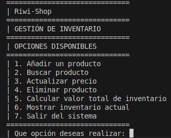

- INSTRUCCIONES DEL PROGRAMA
---
- 1. Inicialmente el programa te solicitara una opción (del 1 al 7) para lograr lanzar la función correcta
  2. Luego de ingresar a la función deseada esta realizara la operación o indicación por la cual fue invocada
  3. Cuando realice las indicaciones te pedira si quieres volver a realizarla y en caso de que no te indicara si deseas salir del sistema o realizar otra funcion
  4. Cuando no quieras hacer otra funcion y quieras salir del sistema, la opción salir finalizara el algoritmo.
---
- EJEMPLOS DE ENTRADA Y SALIDA
---
Lo primero que veras al iniciar el programa, seria esto:
- 
  
