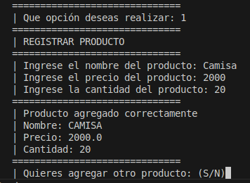
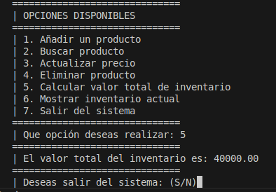

- INSTRUCCIONES DEL PROGRAMA
---
- 1. Inicialmente el programa te solicitara una opción (del 1 al 7) para lograr lanzar la función correcta
  2. Luego de ingresar a la función deseada esta realizara la operación o indicación por la cual fue invocada
  3. Cuando realice las indicaciones te pedira si quieres volver a realizarla y en caso de que no te indicara si deseas salir del sistema o realizar otra funcion
  4. Cuando no quieras hacer otra funcion y quieras salir del sistema, la opción salir finalizara el algoritmo.
---
- EJEMPLOS DE ENTRADA Y SALIDA
---
Lo primero que veras al iniciar el programa, seria esto:
- 

Luego de aplicar una opcion (En este caso la 1) nos pedira mas ingreso de datos para cumplir su funcion:
- 

Y al final nos mostrara el producto agregado y si deseamos ingresar nuevo producto.

Si la opción es la 5, nos dara unicamente la salida de la operación indicada.
- 
---

- Así de esta forma podemos interactuar con nuestro programa, donde le entregamos datos que el requiere para
- operar y nos devuelve datos que necesitamos.

- Almacenando todo en una lista, dividida por diccionarios que cada uno representa un producto con sus detalles.

